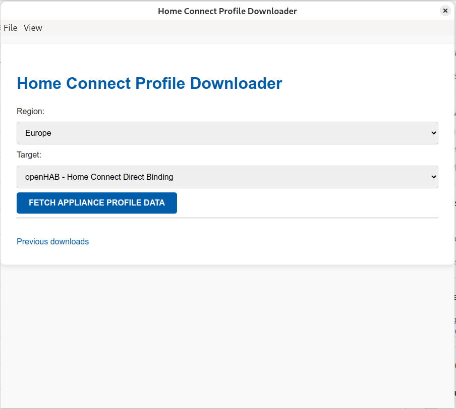

# Home Connect Profile Downloader

This tool fetches profile information for all Home Connect devices linked to your account, enabling direct communication with your appliances over the local network.



## Why Use This Tool?

With the gathered profile information, you can directly communicate with your Home Connect devices within your home network. This is particularly useful for integrations such as the [Home Connect Direct binding for openHAB](https://community.openhab.org/t/home-connect-direct-binding-no-cloud/160857/36).

## Run it

> **Note:** Please ensure you download the correct package file for your system architecture. Use files labeled `amd64`, `x86_64` or `x64` for 64-bit x86 systems, and files labeled `arm64` for 64-bit ARM-based systems.

### On Linux

#### For RPM-Based Systems

Use the `rpm` command to install the package on RPM-based distributions such as RHEL, CentOS, Fedora, or openSUSE.

1. Download rpm file.
2. Open a terminal and navigate to the file you have downloaded.
3. Run the following command, replacing `homeconnect-profile-downloader_<version>_<amd64|arm64>.rpm` with the target architecture and version in the file name:  
   ```bash
   rpm -i homeconnect-profile-downloader_0.9.0_amd64.rpm
   ```
4. Start the application (`homeconnect-profile-downloader`)

#### For DEB-Based Systems

Use the dpkg command to install the package on DEB-based distributions such as Debian, Ubuntu, or Linux Mint.

1. Download dep file.
2. Open a terminal and navigate to the file you have downloaded.
3. Run the following command, replacing `homeconnect-profile-downloader_<version>_<amd64|arm64>.deb` with the target architecture and version in the file name:  
   ```bash
   dpkg -i homeconnect-profile-downloader_0.9.0_amd64.deb
   ```
4. Start the application (`homeconnect-profile-downloader`)


#### For AppImage

The AppImage format allows you to run the application without installation. It is a portable and self-contained executable.

1. Download AppImage file.
2. Open a terminal and navigate to the file you have downloaded.
3. Navigate to the directory containing the .AppImage file.
4. Make the AppImage executable by running: `chmod +x <package-name>.AppImage`
5. Run the AppImage: `./<package-name>.AppImage`

### On Windows

To install and run the application on Windows, follow these steps:

1. Download the ZIP file (e.g. `homeconnect-profile-downloader-win32-x64-0.9.0.zip`)
2. Extract the ZIP file  
   - Navigate to the location where the `.zip` file was downloaded.
   - Right-click on the `.zip` file and select **Extract All...**.
   - Choose a destination folder and click **Extract**.

3. Run the application  
   - Open the folder where the files were extracted.
   - Locate the application executable file (e.g., `homeconnect-profile-downloader.exe`).
   - Double-click the `.exe` file to run the application.
   - Unsigned Application Warning: When running the application, Windows Defender SmartScreen may display a warning that the file could be dangerous because it is not digitally signed.  
      - This warning can be safely ignored.  
      - To proceed:
        1. Click **More info** on the warning message.
        2. Select **Run anyway** to start the application.

### On Mac OS

Unfortunately, there are no pre-built macOS binaries available due to restrictions on running unsigned applications. However, you can build and run the application locally by following these steps:

1. Install Node.js and npm  
   - Ensure you have Homebrew installed on your system. If not, install it by following the instructions at [brew.sh](https://brew.sh).
   - Use Homebrew to install Node.js (version 18) and npm:

     ```bash
     brew install node@18
     ```

   - Follow the brew after installation instructions and open a new terminal window afterwards.

   - After installation, verify the Node.js and npm versions:

     ```bash
     node -v
     npm -v
     ```

2. Clone the repository  
   - Open a terminal and clone the repository:

     ```bash
     git clone https://github.com/bruestel/homeconnect-profile-downloader.git
     ```

3. Navigate to the project directory  
   - Change to the cloned repository's directory:

     ```bash
     cd homeconnect-profile-downloader
     ```

4. Install dependencies  
   - Install the required dependencies using npm:

     ```bash
     npm install
     ```

5. Run the application  
   - Start the application with npm:

     ```bash
     npm start
     ```

## Build and Run

### Prerequisites

Ensure that you have [Node.js](https://nodejs.org/) 18+ installed on your system. You can verify this by running the following commands in your terminal:

```bash
node -v
npm -v
```
If these commands return a version number, Node.js and npm are installed. Otherwise, follow the [Node.js installation guide](https://nodejs.org/en/download/package-manager) to set it up.

### Quick Start

1. Clone the repository:
   ```bash
   git clone https://github.com/bruestel/homeconnect-profile-downloader.git
   ```
2. Install dependencies:
   ```bash
   cd homeconnect-profile-downloader
   npm install
   ```
3. Start the application:
   ```bash
   npm start
   ```
